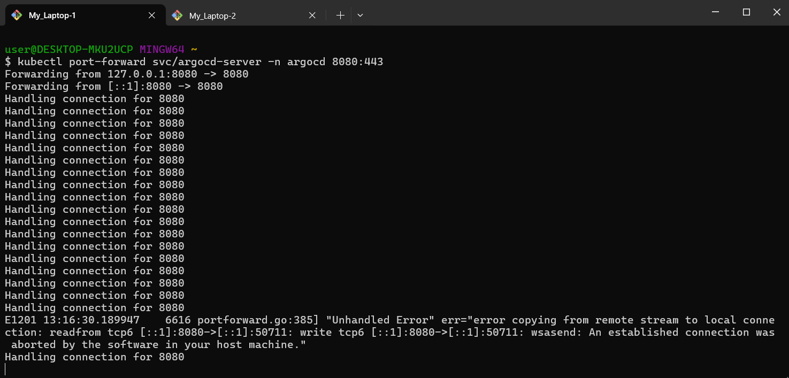
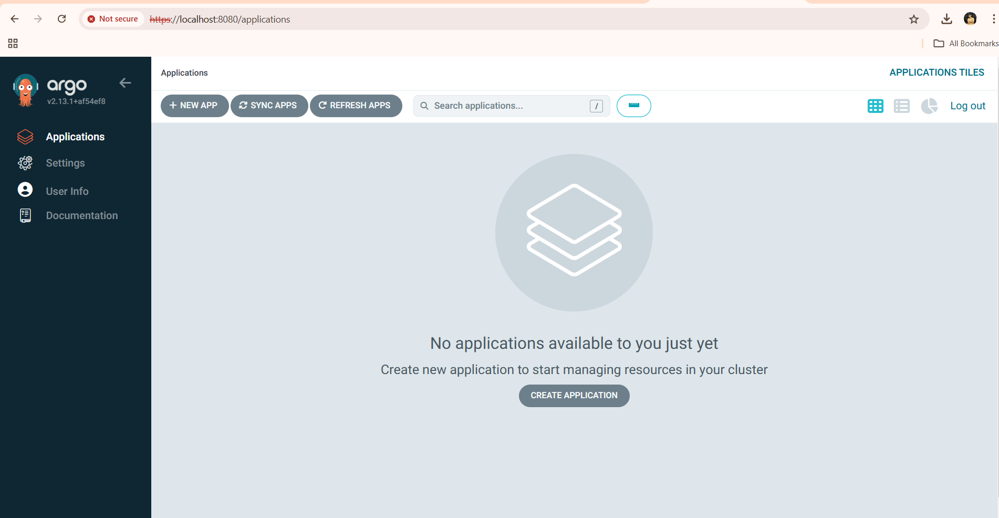

# Argo CD Tutorial: Deploying Your AKS Application with GitOps

- This guide details how to deploy and manage your applications on an Azure Kubernetes Service (AKS) cluster using Argo CD and GitOps principles. GitOps offers a declarative approach to infrastructure and application management, ensuring consistent and version-controlled deployments.

^ Prerequisites: 
- An AKS cluster with kubectl configured for access
- A Git repository (e.g., GitHub)


### Step 1:  Set Up the Git Repository

1. Create a New Git Repository: Establish a new repository on your preferred Git hosting platform

2. Add Kubernetes Manifests:
   - Clone your repository locally.
   - Create a directory named manifests (or any suitable name) within your repository.
   - Add your Kubernetes manifest files deployment.yaml and service.yaml to the manifests directory.

3. Push the Files to Git:

   - Add the manifests directory (or your manifest files) to staging.
   - Commit the changes with a descriptive message (e.g., "Initial deployment manifests for skate-app").
   - Push the changes to your remote Git repository.

```bash
git add .
git commit -m "Message"
git push origin main 
```

### step 2: Create AKS Cluster
 
  [AKS Create](https://github.com/DeepakVakkalaDevOpsMutliCloud/kubernetes/blob/main/install-k8s-cloudhosted-AKS.md)


### Step 3: Install Argo CD


1. Create the namespace:
```bash
kubectl create namespace argocd
```
2. Install Argo CD:
```bash
kubectl apply -n argocd -f https://raw.githubusercontent.com/argoproj/argo-cd/stable/manifests/install.yaml
```
3. Port-forward the service to access the UI:
```bash
kubectl port-forward svc/argocd-server -n argocd 8080:443
```

4. Access the Argo CD web UI at https://localhost:8080


### Step 4: Create the Argo CD Application

- Login to Argo CD:
Retrieve the admin password:
```bash
kubectl get secret argocd-initial-admin-secret -n argocd -o jsonpath="{.data.password}" | base64 -d
```
* Login via the CLI:
```bash
argocd login localhost:8080
```



* Add Your Git Repository to Argo CD:
Replace <GIT_REPO_URL> with the URL of your repository:


```bash
argocd repo add https://github.com/DeepakVakkalaDevOpsMutliCloud/ArgoCD.git
```


* Create an Argo CD Application:
   - Run the following command to create an application in ArgoCD:
```bash
argocd app create webapplication \
--repo https://github.com/DeepakVakkalaDevOpsMutliCloud/ArgoCD.git \
--path manifests/ \
--dest-server https://kubernetes.default.svc \
--dest-namespace argocd
```


### Step 5: Sync the Application

* Sync the application using argocd app sync skate-app to deploy it to your AKS cluster.
```bash
argocd app sync webapplication
```

* Verify the Deployment:
   - Check the resources in the Kubernetes cluster:
```bash
kubectl get all -n argocd 
```


### Step 6: Monitor and Manage the Application
- Check Application Status:
```bash
argocd app get webapplication
```
- View Logs:
To view logs of a specific pod:
```bash
kubectl logs <POD_NAME> -n argocd
```
* Update the Application:
    - Modify the manifests in the Git repository.
    - Commit and push the changes.
    - Argo CD will detect the changes and show the application as "OutOfSync".
* Sync Again:
```bash
argocd app sync webapplication
```


### Step 7: Enable Automatic Sync (Optional)
* To enable auto-sync for the guestbook application:

```bash
argocd app set webapplication --sync-policy automated
```

### Step 8: Clean Up
To delete the application and resources:

```bash
argocd app delete guestbook
```
### Step 9: To uninstall Argo CD:

```bash
kubectl delete namespace argocd
```